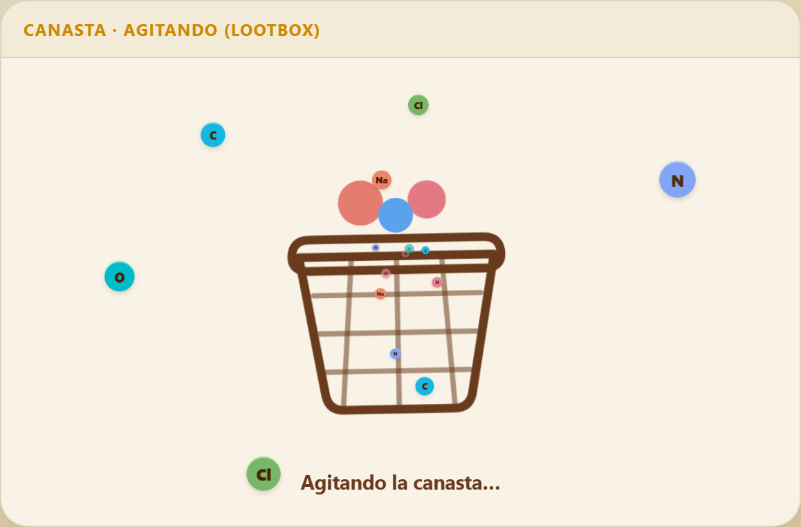
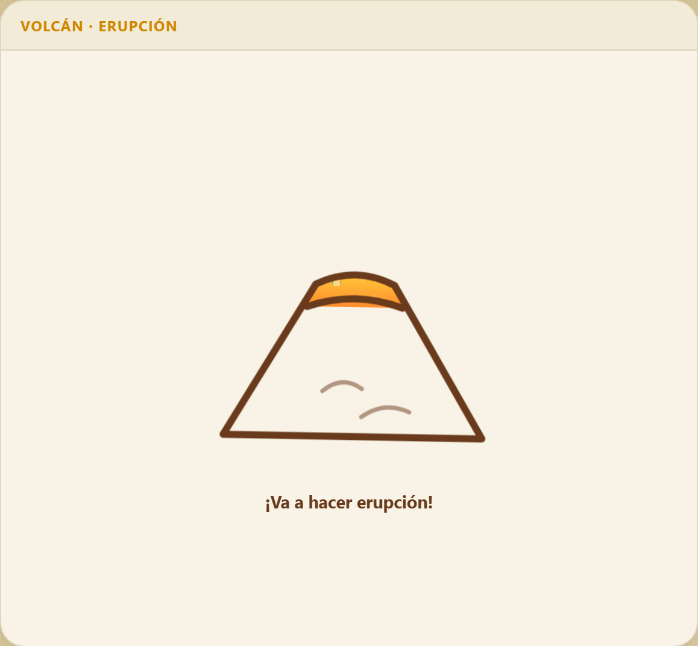
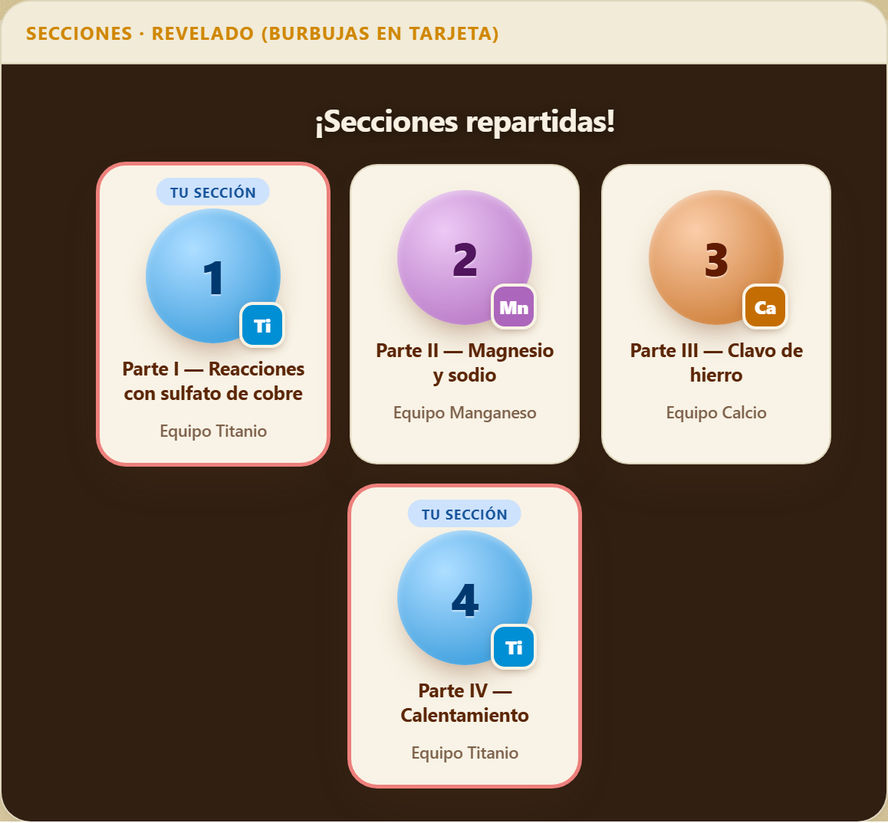
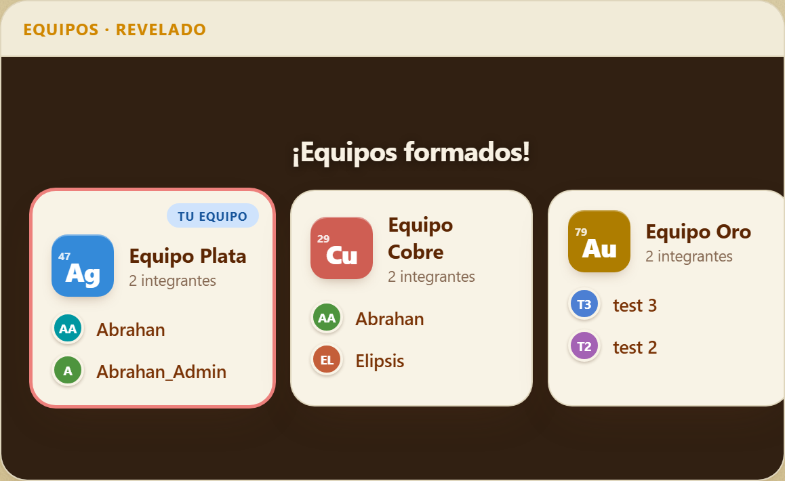
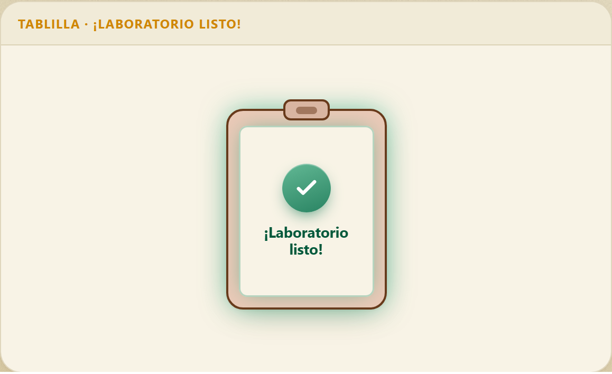
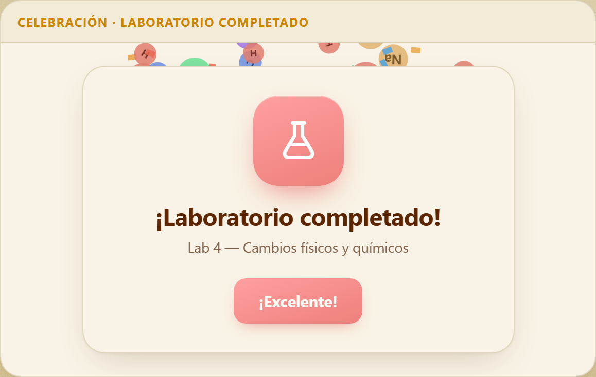

<div align="center">

# 🧪 Bitácora de Lab

**Una bitácora colaborativa en tiempo real para grupos de laboratorio de química.**

[](https://lab4cambiosmateria.vercel.app)
[](https://vercel.com)
[](https://supabase.com)
[](index.html)
[](LICENSE)

El grupo registra las **partes** de cada práctica, sube **evidencia fotográfica** desde el celular,
se organiza en **equipos** y reparte las **secciones** del laboratorio — todo sincronizado
al instante entre los dispositivos de la clase.

</div>

---

## ✨ Vistazo rápido

| Equipos estilo "lootbox" | Secciones con volcán | Tu sección |
|:---:|:---:|:---:|
|  |  |  |

| Equipos revelados | Tablilla "¡Listo!" | Celebración |
|:---:|:---:|:---:|
|  |  |  |

## 🎯 Qué es

Una bitácora de laboratorio multi-dispositivo con cuentas reales y dos roles —**admin** y
**equipo**— donde todo lo que pasa (una parte marcada como hecha, una foto subida, un equipo
formado, una sección intercambiada) aparece al instante en las pantallas de los demás.

Está pensada para una clase real: el administrador (profesor o líder) arma la práctica y
recopila la evidencia, mientras cada equipo trabaja su parte y documenta lo que hizo.
**Se usa en clases reales** en la Universidad Latina de Panamá.

## 🚀 Lo que hace

**📒 Bitácora**
- Cuentas reales con registro e inicio de sesión; roles **admin** y **equipo**.
- El admin crea **laboratorios** divididos en **partes** (o **fases**, o **experimentos** —
  la app adopta la palabra que use la guía) y asigna compañeros a cada una.
- Cada persona marca su parte como **hecha** y sube una **foto** de evidencia
  (cámara en vivo dentro de la app o desde la galería).
- **Instrucciones detalladas** por parte: pasos textuales y preguntas de análisis,
  con seguimiento de progreso personal.
- **Importar desde PDF**: se sube la guía de la práctica y Claude separa las partes y
  extrae los pasos textuales automáticamente. Reconoce guías con secciones
  `I. PARTE / II. PARTE` y guías con `FASE A / FASE B`.
- El admin **ve y descarga** toda la evidencia (por foto, por parte o el laboratorio completo).

**🧑‍🤝‍🧑 Equipos**
- Un **repartidor de equipos** estilo "lootbox": el admin elige a los presentes, agita una
  **canasta animada** y se forman las parejas (un trío si son impares).
- Cada equipo recibe el nombre de un **elemento de la tabla periódica** (Equipo Cobre, Oro, Plata…).
- Quien no quedó donde quería puede **solicitar unirse** a otro equipo; el admin aprueba
  y aparece una celebración con confeti.

**🌋 Secciones**
- Un **repartidor de secciones** con un **volcán animado** (burbujea, sube la presión y hace
  erupción) que asigna los equipos a las partes del laboratorio.
- Al terminar, las secciones se revelan como burbujas y la pantalla hace **zoom a la sección de tu equipo**.
- Los equipos pueden **intercambiar secciones por mutuo acuerdo**: uno propone el cambio y el
  otro lo acepta, sin pasar por el admin. El admin también puede reasignar manualmente.

**🎨 Detalles de la experiencia**
- **Tiempo real** en toda la app (indicador "EN VIVO"), con reconexión automática al volver
  del bloqueo de pantalla o de una caída de wifi.
- Fondo animado de **elementos químicos** que rebotan, se fusionan en compuestos
  (H₂O, NaCl, CO₂…) y se pueden **arrastrar** con mouse o dedo.
- Animaciones de carga (matraz Erlenmeyer), transición de entrada, celebraciones con
  confeti de átomos y una onda de color al tocar la pantalla.

## 🛠️ Con qué está hecho

| Capa | Tecnología |
|---|---|
| **Frontend** | Un solo [`index.html`](index.html) en JavaScript vanilla — sin build, sin framework. Tema cálido en OKLCH, animaciones en CSS + Canvas. |
| **Backend** | [Supabase](https://supabase.com): autenticación, Postgres con Row Level Security, Storage para fotos y Realtime. |
| **IA** | Función serverless en Vercel ([`api/parse-lab.js`](api/parse-lab.js)) que usa la API de Anthropic (**Claude Haiku 4.5**, `claude-haiku-4-5`) para leer los PDF de las guías. |
| **Hosting** | Vercel, con despliegue automático desde GitHub. |

## 📁 Estructura del repo

```
index.html          # toda la app (UI + estilos + lógica, JS vanilla)
api/parse-lab.js    # función serverless: PDF → partes (Claude)
SQL/                # scripts de Supabase (esquema + RLS + realtime)
docs/screenshots/   # capturas para este README
tools/              # utilidades de dev (galería de animaciones + capturas)
ARCHITECTURE.md     # cómo funciona todo el sistema
CONTRIBUTING.md     # flujo de ramas y PRs
```

## 💻 Para desarrolladores

¿Quieres correrlo o contribuir? El sistema completo (frontend, base de datos, función
serverless, seguridad y despliegue) está documentado en **[ARCHITECTURE.md](ARCHITECTURE.md)**.

**Inicio rápido:**

1. Crea un proyecto en [Supabase](https://supabase.com) y corre los scripts de `SQL/` en orden
   (detalle en [ARCHITECTURE.md §6](ARCHITECTURE.md#6-base-de-datos-supabase--postgres--rls)).
2. Pon tu `SUPABASE_URL` y `SUPABASE_ANON_KEY` en `index.html`.
3. Para el import de PDF, define `ANTHROPIC_API_KEY` como variable de entorno en Vercel.
4. Corre en local con `vercel dev` (app + función) o sirve `index.html` como estático.

No hay paso de build: el frontend es un solo `index.html` editable a mano.
Abres el archivo, cambias algo, recargas. Eso es todo el ciclo de desarrollo.

## 🤝 Contribuir

¡Las contribuciones son bienvenidas! Lee **[CONTRIBUTING.md](CONTRIBUTING.md)** para el flujo
de ramas/PRs y el estilo de código. En resumen:

```
rama descriptiva  →  commits claros  →  PR hacia main
```

`main` se despliega solo a producción, así que mantenlo sano. Buenos primeros aportes:
nuevas animaciones de celebración, soporte para más formatos de guía en PDF, o mejoras
de accesibilidad.

## 📄 Licencia

[MIT](LICENSE) — úsalo, apréndelo, mejóralo.

---

<div align="center">

Hecho con ☕ y química por **Abrahan Aparicio** · Universidad Latina de Panamá

</div>
